#Creation of Digital Server using gRPC
## Digital Abstraction Layer
The Data Converter Validation Module (DCVM) previously was developed for a specific DUT (AD7606B).  To enable support for different DUTs, a new approach has been devised using the Digital Abstraction Layer (DAL) in Data Converter Validation Module 3.0.  
The Digital Abstraction Layer (DAL) enhances the Data Converter Validation Module by introducing abstraction for various Devices Under Test (DUTs), enabling users to extend/implement support for their DUTs. DAL introduces a dynamic solution with user-owned server projects interfacing with specific DUTs and a DCVM-owned client project. 
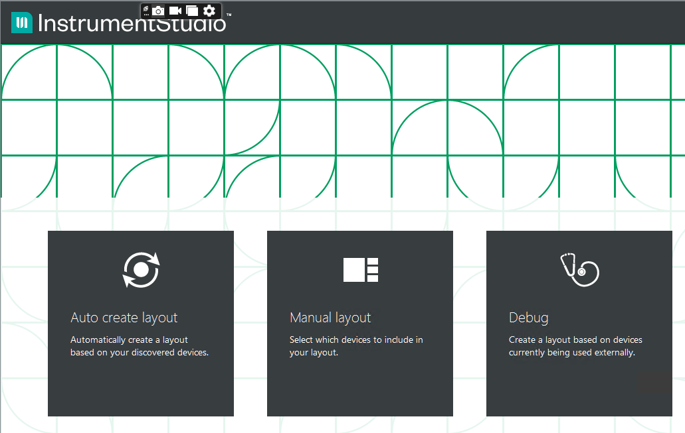
### gRPC Server-Client Implementation
The connection between the server and client is established through the gRPC framework, making it flexible and easy for users. With gRPC, DAL ensures smooth communication between client and server applications in a distributed environment, offering a high-performance, open-source RPC solution.

gRPC is a high performance, open-source RPC framework initially developed by Google. The framework is based on a client-server model of remote procedure calls. A client application can directly call methods on a server application as if it was a local object. To learn more about gRPC framework, click here (add proto file location)
## Steps to create a Digital Server for the DUT Interface:
### Step 1: Create a Digital Server Project
1.  Make sure LabVIEW 2021 SP1, or a higher version is installed.
2.	Download Version 1.0.0.1 LabView gRPC tool dependencies (grpc-labview.zip) from the git repository (link) and extract the zip file for server and client project creation.
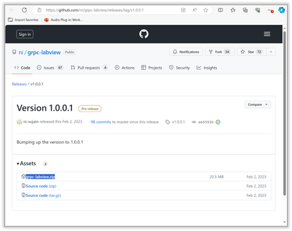
3.	Launch VI Package Manager, and click on the downloaded files shown below, install in the order given below.
    a. ni_lib_labview_grpc_servicer-1.0.0.1.vip	
    b. ni_lib_labview_grpc_library-1.0.0.1.vip
    c. ni_lib_grpc_server_and_client_template[2] -1.0.0.1.vip
4.  For digital abstraction layer, there is a predefined proto file called dcvmDigitalInterface.proto. It can be used to generate client and server code in various programming languages using gRPC tools. Let's see how we can generate server code in the LabView programming language. Click here to download the dcvmDigitalInterface.proto file.
5.	To generate a server code, we need an existing LabVIEW project. If you don’t have an existing project, create a project and save it. Open LabVIEW->File -> Create Project -> Finish. Save the project as “dcvmDPI_server.lvproj” in any preferred location.
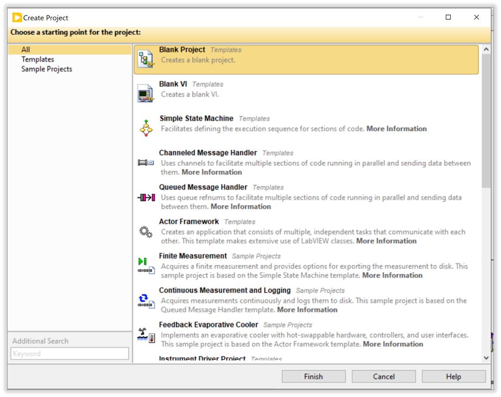

6.	Open LabVIEW and navigate to Tools > gRPC > Open gRPC Server-Code Generator.
A VI as shown in the image will appear.
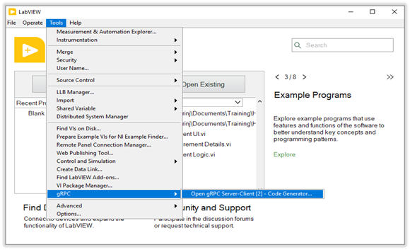

7.	Using this gRPC Server-Client Generator, you can create server and client code libraries in LabVIEW.

Please configure the inputs as explained below:

a.	Proto File Path: Select the downloaded dcvmDigitalInterface.proto file.
b.	Target Project: Select the saved dcvmDPI_server.lvproj or any saved project. 
c.	Generated Library Name: Give a name for the digital server you want to create name it as dcvmDPI_<DUT_Name> for better understanding.
d.	Generate: Select gRPC Server for server code creation.
e.	Run the VI. (this process might take some time to create the server library in the project).

8.	LabVIEW tools will handle the creation of libraries, controls, and VIs using the proto file, resulting in the creation of digital server library in the lvproj as shown below.

9.	This dcvmDPI server library is used to communicate with the client APIs (which is part of Measurement Plugins) using gRPC framework. This library holds the responsibility of acquiring the request data from the client and passing the response data to the client whenever client calls happen.

10.	To implement the DUT Interface with the digital instrument, create a separate library which call Server Implementation library. You could name it as dcvmDPI_<DUT_Name>_serverImpl.lvlib.

This Library has the implementation of Driver APIs for communication with DUT interface in Process.vi with including controls and subVIs as shown below. We will discuss in detail about the Implementation in Step 3

## Step 2: Add Message Queues for Synchronization
1.	Communication from Measurement plugin (gRPC client) to the DUT Interface through the Digital Server (gRPC server) happens as explained below.

    a.	Any request from gRPC client is captured by ‘Start Sync.vi’ in gRPC server library which passes the request to ‘Process.vi’ in gRPC server implementation library.
    b.	‘Process.vi’ communicates with DUT through the hardware interface, fetches the Digital data and returns it back to ‘Start Sync.vi’ which in turn returns the data to the gRPC client.
    c.	The communication between ‘Process.vi’ and ‘Start Sync.vi’ happens through two message queues.
        i.	gRPC queue: Used for communication from Process.vi to Start Sync.vi
        ii.	Digital queue: Used for communication from Start Sync.vi to Process.vi
    
2.	The two queues are implemented using a data cluster of ‘Message’ and ‘Message Data’. The ‘Message’ specifies the command or the action to be performed, whereas the ‘Message Data’ specifies the data associated with the command. 
3.	APIs for creating & destroying message queues, getting message queues in other libraries are implemented in ‘dcvmMessageQueue.lvlib’. This library can be used as such.

4.	The ‘Get message queues.vi’ can be used in other VIs to get the message queue references. i.e., Digital engine and gRPC engine.

## Step 3: Implement DUT Interface related APIs.
1.	Let’s take a look at the Server Implementation Library in detail in this section.

    a.	Session.ctl: Update the instrument reference control of the required DUT interface. Bit file reference can be used if a Digital Pattern instrument is used and ignored otherwise.
    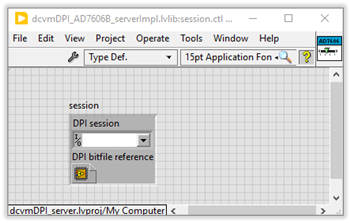
    b.	Process VI:  In Process.vi, the implementation of interface configurations (using Driver APIs) needs to be done right from initializing the instrument communication to configure the settings to initiate & fetch the measurement to closing the communication. 

    You could get started with the example Digital Server project and libraries and update the required driver APIs specific to your DUT to configure the required settings. Refer the steps below which explain each of the cases in Process.vi to understand the changes required.

        i.	ID:  In this case, DUT name is passed as ID_response through the gRPC message queue to Start Sync.vi.  Update the new DUT name here instead of ‘AD7606B’.
        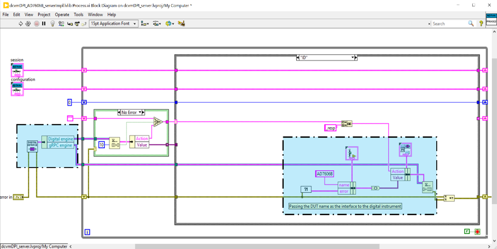
        ii.	Measurement Parameters: Here, the Measurement Parameters are updated in the Configuration typedef. No need to make any changes in this case.
        
        iii.	Initialize: In Initialize.vi, implement the driver APIs to initialize the interface.
        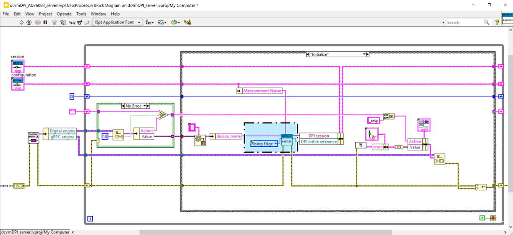
        iv.	Configure: In Configure.vi, implement the driver APIs that configures the interface, Settings. Ensure that the Data Buffer.vi is initialized with the inputs of the number of channels and samples per channel.
        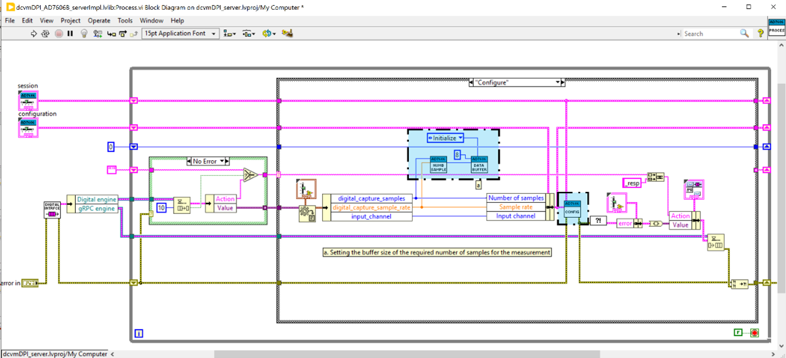
        v.	Initiate: In Initiate.vi, implement the driver APIs that initiate the measurement in the interface.
        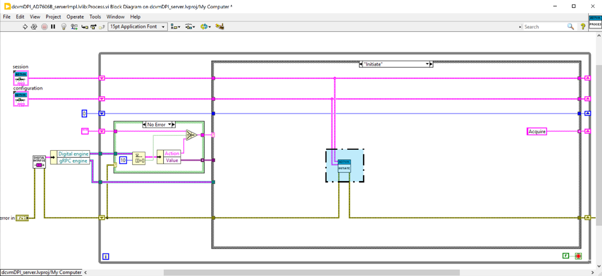
        vi.	Acquire: In Acquire.vi, implement the driver APIs needed to acquire data from the DUT. Ensure the acquired data is written to the Data Buffer.vi.

        Please note that the data buffer expects data in 2D Numeric array (Uint32) format. Ensure to convert the data into the mentioned format in case if it’s in 1D array or any other format.
        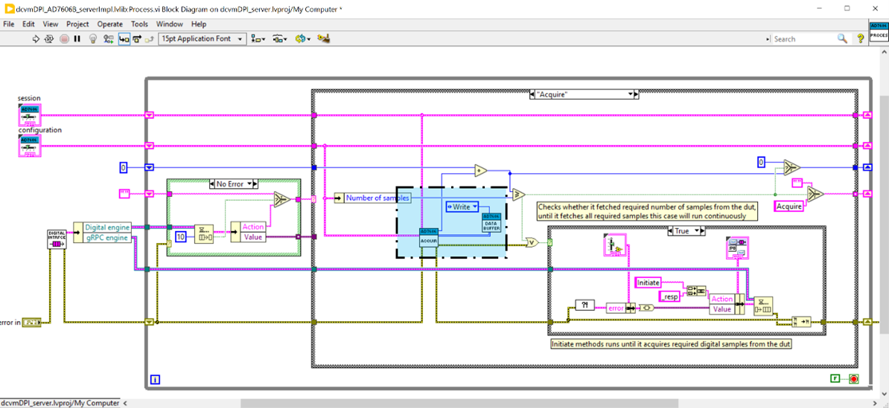
        vii.	Close:  In Close.vi, implement the driver APIs that closes the interface communication. Ensure data buffer is reset in the Close case.
        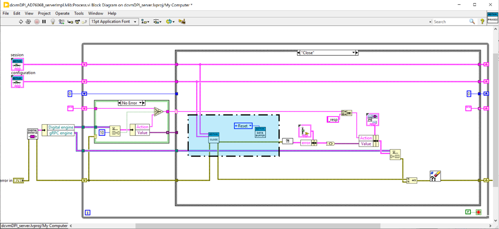
## Step 4:  dcvmDPI_Server Library:
You could reuse the Server Library, Message Queues, Utility and Data buffer for server creation. Implement the digital interface only in dcvmDPI_<DUT_Name>_serverImpl” library. If you would like to explore and understand the implementation, you can follow the below modules.
1.	Start Sync VI: The Start Sync.vi comes along with the gRPC server and it communicates with Client API and Process.vi.

    When we get a request from client API, user event is captured in the Start Sync.vi. In turn, it enqueues the corresponding commands in the ‘Digital engine’ queue (to be processed by Process.vi) and waits for the response in ‘gRPC engine’ queue.

    Start Sync.vi can be used from the example server project as such.
    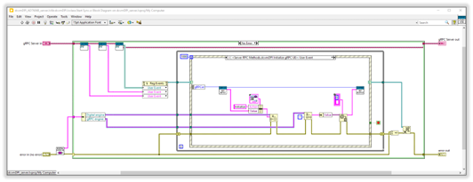
2.	Run Service VI: 
    a.	When you run the Run Service.vi, it starts the gRPC server that hosts and runs the defined gRPC service. The gRPC server is responsible for handling incoming RPC (Remote Procedure Call) requests from clients, invoking the appropriate service methods, and returning the corresponding responses.

    In Run Service Block diagram, replace the library class with dcvm_DPI class to run the service to host the server.
    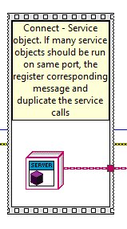
    b.	In the Run Service VI, make sure to call the ‘Create Message Queues.vi’ first to initialize the Digital Engine and gRPC Engine queues, that will be needed communication between the Process.vi and Start Sync.vi.
    
## Step 5: Include dependencies
Make sure to add any other files that will be required to make the Digital server run with the DUT interface.
For example, in the given example Server project, bit file, pin map file, pattern file, etc. are required to interface DUT with Digital interface. 

## Step 6: Build and Run Digital Server
1.	Running the Digital server VI: In server project, open the Run Service.vi and run the service that hosts and runs the defined gRPC service. 

2.	Building.exe:
    i.	For creating the .exe for the server project, 
    
    ii.	Once the build is complete, go to the location where EXE is present
    
    iii.	Run the digital server exe file ‘AD706B_DPIserver.exe’
    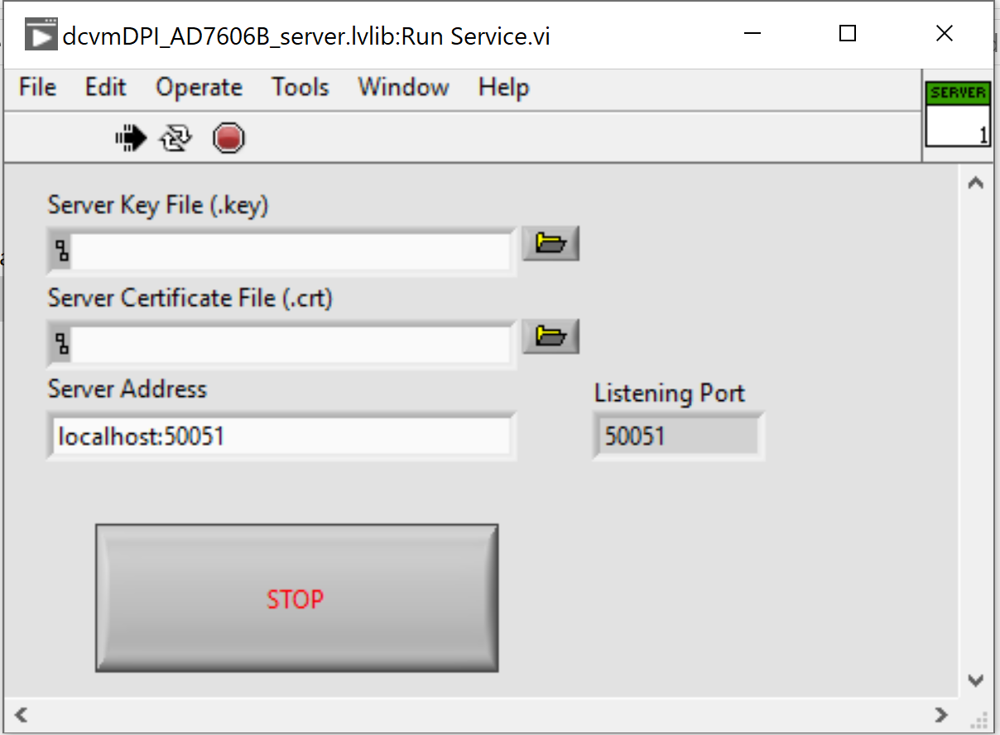
## Step 7: Connect the DCVM plugin to the server and perform measurements
 You can follow the steps to run the adc-dcvm measurements by refering this document.
