# Getting Started

## Adding a measurement panel to InstrumentStudio
Setting up the InstrumentStudio Panels
Open InstrumentStudio

Click Manual Layout, and select AC measurement service in the large panel. Click OK.

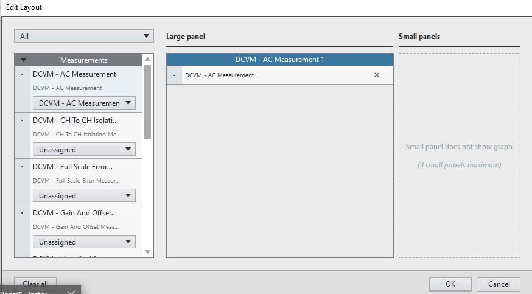

AC measurement UI will get displayed on a large panel as below screenshot.

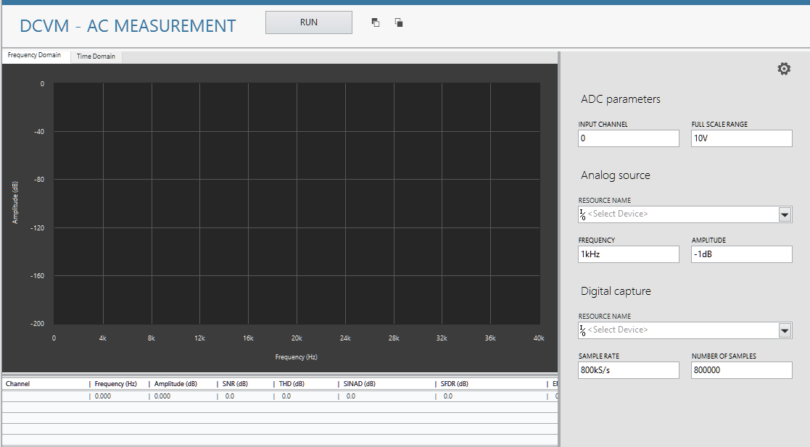

Open a new tab, Under PXIChassis 1 -> SMU/Power supply PXIe-4145 -> large panel -> SMU/Power supply PXIe-4139 -> SMU/Power Supply 1

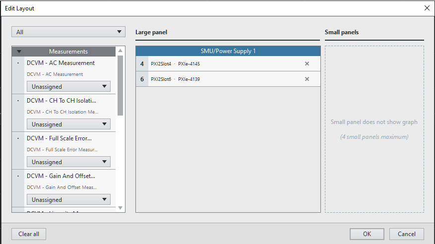

All panels are set.

Powering ON
Set 3.3 V and 5 V Supplies according to the actual board connections:

Turn on the Output for each SMU.

AC Measurement Software Workflow

Go to the C:\ProgramData\National Instruments\MeasurementLink\Services\Digital Server. Click on AD7606B_DPIserver.exe before running the measurement service.

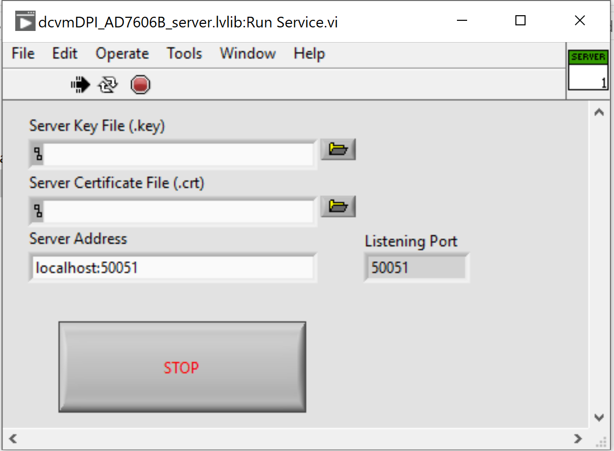

Run the measurement service with the default values and select the appropriate resource names. Press run.

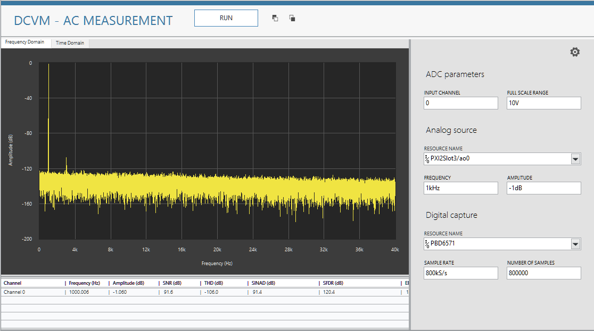

The measurements in Frequency and time domain graphs should be visible.
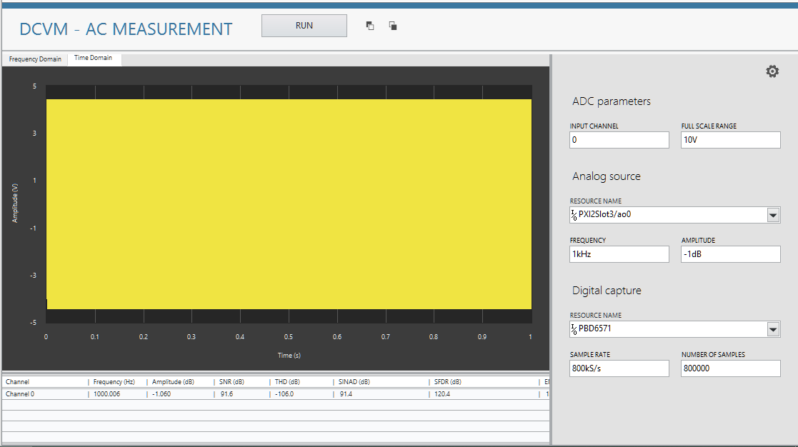

## Adding a measurment step to TestStand 

The following workflow provides an example to show how we can automate our measurements using TestStand from the Instrument Studio and also shows how monitoring can be done. 

After following above steps to add measurement service into the Instrument Studio.

1. Open TestStand 21.0 or higher version. Open new sequence file or saved sequence file. 
 
   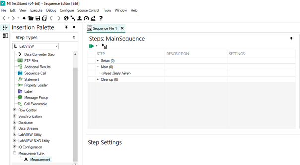
2. To transfer the measurement configuration from the Instrument Studio to the TestStand, click on "COPY button" highlighted in the screenshot.

   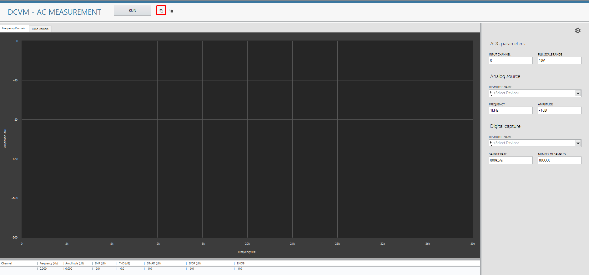

3. In InstrumentStudio, copy the measurement configuration from the InstrumentStudio to the TestStand select the "Copy Measurement Configuration"

   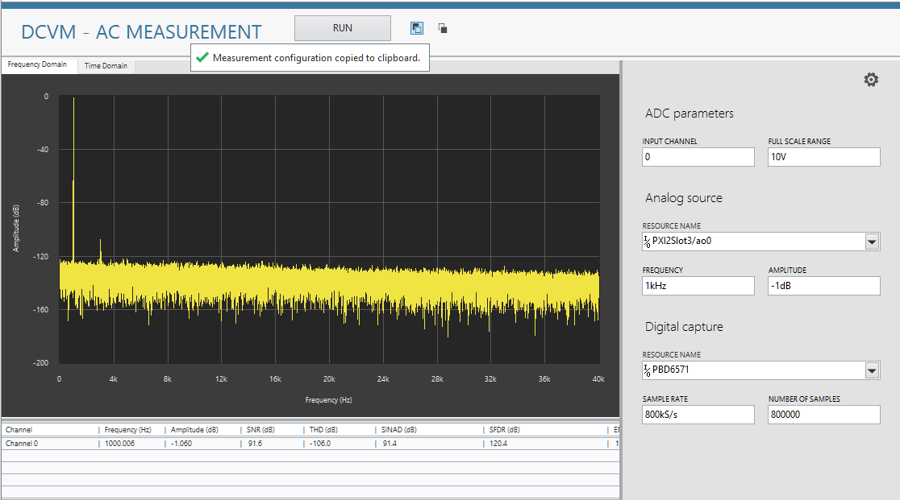

4. In TestStand, from the insertion Palette, select the measurement link step, add it to the sequence file, and click on the paste button as highlighted in the screenshot. Make Enable monitor to True.

  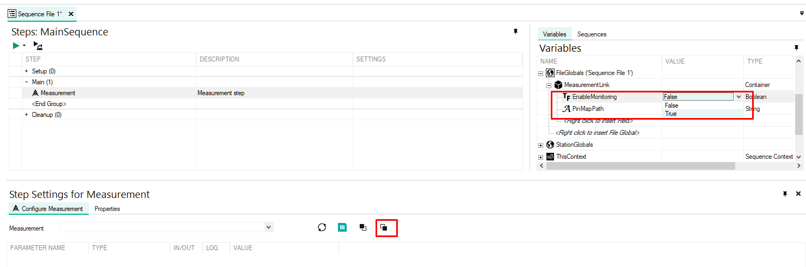

5. The measurement configuration copied to the TestStand saved sequence file.

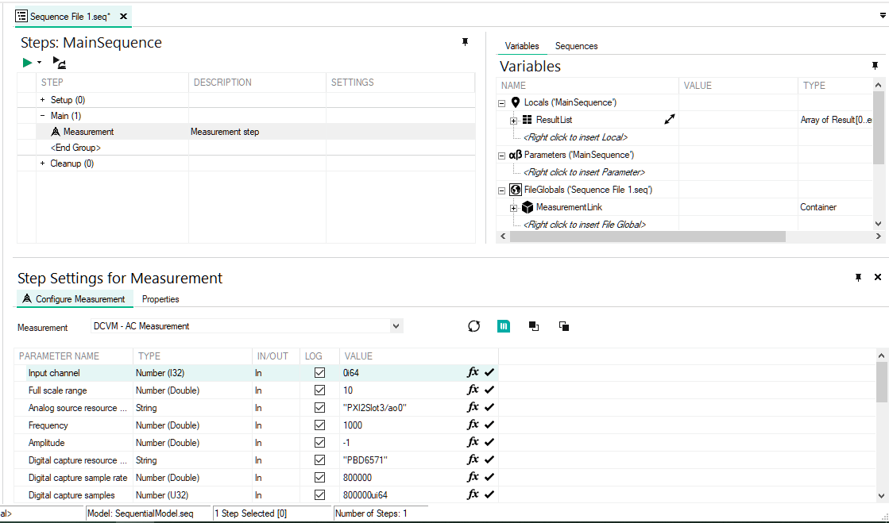

6. Save the Sequence file and RUN the sequence. While running the sequence file in TestStand you can see measurement resultant graphs and results were updated in the InstrumentStudio as well.

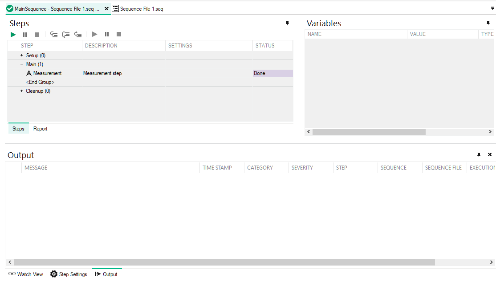

7. The measurement results are updated in the Instrument Studio as below.

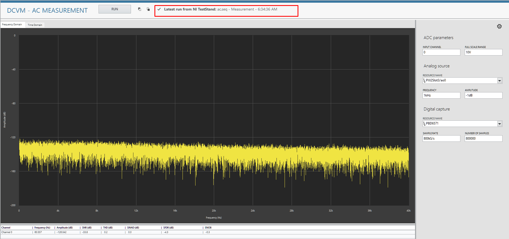
## Measurements
### AC
### AC MultiChannel
### Linearity
### Gain and Offset
### Full Scale Error
### Channel to Channel Isolation
